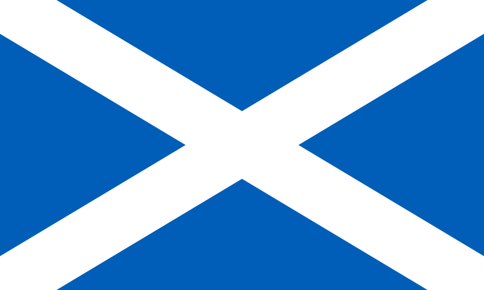

<h1 align=center> 

Astrid 
</img>
</h1>
<p align=center><i>Source Code to impROVise's ROV, Astrid</i>
<br><br><br>
</img>

---

## Usage
> [!IMPORTANT]
> We use a Raspberry Pi 4 for both the the client and the server.

Create a Python Virtual Environment:
```
python -m venv .venv
```

Activate the virtual environment:
```
source .venv/bin/activate
```

Install dependencies to virtual environment:
```
python -m pip install -r requirements.txt
```

### Running:
```
python main.py --client --ip <IP = 127.0.0.1> --port <PORT = 8080>
```

```
python main.py --server --ip <IP = 127.0.0.1> --port <PORT = 8080> [OPTIONAL: --simulated]
```

> [!TIP]
> - Use `--poolside` for the code that runs on the computer on the poolside.
> - Use `--rov` for the code that runs on the ROV.
> - Use `--simulated` on the server to test the software without the actual hardware attached.

---

# Hardware
We use a Raspberry Pi 4 onboard our ROV for flight control. This Pi 4 is connected to a I2C PCA9685 board to control our motors and servos. The addresses for this board are defined in [consts.py](src/consts.py), as well as some other physical quantities such as motor throttles and servo angles. We use Ethernet cable for our tether, and the poolside client computer is a Raspberry Pi 4.


---
# Licensing
We use an MIT License. (Please see [LICENSE](LICENSE) text!) Please feel free to use this code to learn!


---
<footer align=center> 
    <i>made in scotland with love</i>
    <br>
    </img>
</footer>